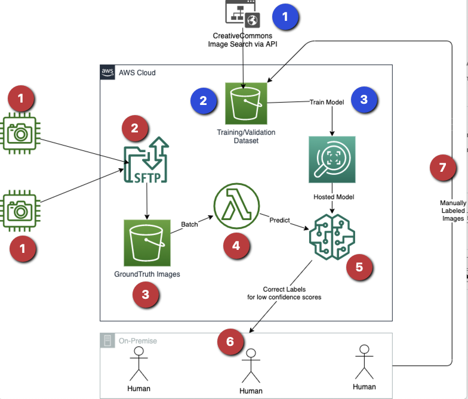

# Cloud shape Classifier using Amazon Rekognition

## Architecture

Amazon introduced [Rekognition Custom labels](https://aws.amazon.com/blogs/machine-learning/announcing-amazon-rekognition-custom-labels/) feature in Nov'2019. As of this writing only project creation and custom label detection are supported via CLI/SDK. The training portion needs to be managed via Console. 

The following diagram highlights two flows. The flow sequence in blue is the initial setup. The flow sequence in red is the flow that runs more frequently. This is a work in progress.

### Training the model

  1. Collect initial image set from [Creative Commons API](https://api.creativecommons.engineering/v1/)
  1. Upload the images to S3, organize the images by labeled folders.
  1. Train the Amazon Rekognition Custom Labels model.

### GroundTruth

  1. Images are captured by a Raspberry Pi with a camera. 
  1. Images are uploaded to SFTP Transfer service. Each device uploads images to their own folder.
  1. SFTP service stores the images to an S3 bucket.
  1. Lambda function runs on a schedule (once a week, as currently there is only 1 device). In the future this could be a continuous process. 
  1. Amazon Rekognition model needs to be started and stopped for each prediction. This is also one of the reasons, a Lambda runs on a schedule to batch process multiple predictions. 
  1. If a prediction accuracy is low, the [Amazon A2I](https://aws.amazon.com/augmented-ai/) process triggers where a Crowd Form is sent to human labelers.
  1. Once the images with low confidence are re-labeled, the images are passed to model for retraining.
  